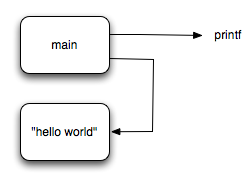
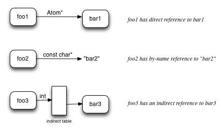

原文链接：https://opensource.apple.com/source/ld64/ld64-136/doc/design/linker.html

## 简介

Darwin Linker 是新一代链接器, 它不像其它传统 Linker 把不同 object 文件中的各部分混和在一起。Darwin linker 基于「原子」，基于文件片段的传统 linker 可以处理简单的链接任务，但是这种模型想实现高级链接功能时会比较困难，如针对未使用代码的裁剪、函数位置重排、C++ 代码聚合等需要链接器在更细粒度上工作的部分。

「原子」是一个不可分割的代码或数据块。一个原子有一组属性，如：名称、作用域、内容类型、对齐方式等。一个原子还有一个连接线列表（Fixups）。一个 fixup 包含：类型、偏移量 (可选)、附加数据(可选)和目标原子(可选)。

原子模型使得链接器能够使用标准图模型来表示链接的数据结构 (原子图)。每个原子是一个节点，每个Fixup是一条边。无用代码裁剪的功能是通过跟踪边来标记所有活原子，然后删除非活原子来实现的。

## 原子模型

「原子」是一个不可分割的代码或数据块。通常每个用户编写的函数或全局变量都是一个原子。此外，编译器可能会生成其他原子，例如，字面量 C 字符串或浮点常量，或者运行时数据结构, 如调试信息(dwarf unwind info)或指向初始化器的指针。

一个简单的 "hello world "对象文件的模型是这样的。



它包含两个原子：main 和一个包含 C 字符串 "hello world" 的匿名原子。原子 "main "有两个连接点。一个是 printf 函数的调用点，另一个是加载 C 字符串地址的指令。

## 文件模型

链接器将输入文件看成是 Atoms 和 Fixups 的容器，以及一些文件自身的属性。链接器处理三种文件：代码编译出的目标文件、静态库和动态库。每种文件都有相应的读对象，它将文件处理成链接器所需要的数据模型。

### 目标文件

目标文件 ( object file ) 是「原子」的容器。当链接目标文件时，所有原子都会被添加到初始化的链接的原子图中。

### 静态库

静态库是包含各种目标文件的及「目录」的归档。当链接静态库时，默认情况下，初始的原子图中不会添加任何内容。相反，如果在所有原子的主图中存在未解决的引用（悬边），而静态库的目录中说明其中有一个对象文件定义了缺失的符号（悬边），那么静态库中指定对象文件的原子集就会被添加到当前原子图中。

### 动态库

动态库的独特之处在于它不直接向数据图中添加任何原子。它们的目的是在构建时检查所有的引用是否能够被解析到，并提供一个在运行时需要的动态库列表（SO_NEEDED）。动态库在链接器中建模的方式是，动态库不向原子图贡献任何原子。如果在原子图中存在未解决的引用（悬边），而动态库提供了所需的符号，那么链接器就会实例化一个 "代理 "原子。代理原子可以让原子图中的所有引用（边）都得到解析，并记录这个符号来自哪个动态库。

## 链接步骤

使用抽象原子，使得链接的核心是独立于平台架构和文件格式。所有的命令解析都会被分解抽象成一个独立的 "选项 "，链接器通过使用不同的命令来驱动。

链接总体可以分成以下步骤

* 命令处理
* 解析输入文件
* 解析
* 分析、优化
* 生成输出文件

解析和分析优化步骤是在原子图上完成的，所以它们没有 mach-o 或 ELF 等文件格式的概念。

### 解析

解析步骤将每个对象文件中的所有原子图合并成一个主对象图。不过，这并不是把每个文件中的原子列表追加到一个大列表中那么简单。有很多情况下，需要将原子凝聚起来。也就是说，需要将两个或多个原子凝聚成一个原子。以此支持 C 语言的 "暂定义符号"，C++ 模板和头文件中定义内联的弱引用，以及合并常量，如 C 字符串和浮点常量。

链接器支持按名称和按内容进行合并。按名称合并用于暂定定义和弱引用。按内容合并用于合并常量数据。

当一个原子对另一个原子有引用 (FixUp) 时，也有一个绑定类型：按名称绑定、直接绑定或间接绑定。如果绑定类型是名称，则这个 Fixup 会包含一个特殊的联合体，联合体内部是一个指向 C 字符串的指针。如果绑定类型是直接的，则联合体内是指向 Atom 的指针。如果绑定类型是间接的，联合体是指向原子指针表的索引。

下面是绑定类型的图示：



输入文件的原子只包含直接引用和按名引用两种形式。直接引用用于同一对象文件中定义的原子，目标原子要么未命名，要么不能改变。例如，在一个函数中调用静态函数将生成一个对静态函数原子的直接引用。另外，函数的 FDE（dwarf unwind info）也有对其函数的直接引用。另外，全局符号的引用（如调用printf）在目标文件中使用名称绑定。

解析过程中会维护一些全局链接的 "状态"，包括："符号表" 是字符串到原子的映射，间接符号表是一个保存原子指针的变长数组，每一种可聚合的常量都有一个原子的表。通过这种数据结构，链接器遍历所有输入文件中的所有原子。对于每个原子，它检查该原子是否应该在一个符号表或一个聚合表中。如果是，它就会尝试添加该原子。如果在该表中已经有一个匹配的原子，这意味着当前原子需要与找到的原子进行聚合。

为了支持聚合，所有对可聚合原子的引用都改为间接绑定，并在间接表中添加一个条目，该条目指向当前选择的原子。当解析器处理完所有输入原子后，应该只剩下直接绑定和间接绑定。如果间接表中有任何 NULL 条目，则意味着有未定义的引用。然后，链接器会查找提供的库（包括静态和动态库）来解析这些引用。

在解析结束时，会进行无用代码剥离（如果需要的话）。链接器做一个简单的标记和扫描。它从 "根" 原子开始（就像可执行文件中的 "main"），然后跟踪每个引用，并将它访问的每个Atom标记为 "活"。完成后，所有未标记为 "活 "的原子都会被删除。

### 分析（Passes）

Passes 步骤是一组开放的流程，每个流程都会修改或增强原子主图。Passes 只有在原子主图完全解析（没有悬空的边）的情况下才会运行。目前Darwin链接器中的Passes集有：

* Objective-C优化（苹果）
* (stub) PLT 生成
* GOT 实例化
* TLV实例化（苹果）
* order_file 优化
* branch island 生成
* branch shim 生成
* 跟踪探针处理(苹果)
* compact unwind encoding (Apple)

其中一些处理是苹果的运行时环境所特有的，但许多处理适用于任何操作系统（例如为超出范围的分支指令生成分支「岛」）。

Pass 的一般步骤是走遍主图，检查每个原子并做一些事情。例如，stub pass，走遍整个图，寻找具有代理原子调用位点的原子（例如调用 printf）。然后，它为每个需要的代理原子实例化一个 "stub" 原子（PLT条目）和一个 "懒惰指针 "原子，这些新原子被添加到主图中。接下来，所有对代理原子的调用点都会被相应的 stub 原子的调用所取代。

### 生成输出文件

一旦分析全部完成，输出文件生成器就会得到一个排好序的原子列表。它的工作是创建可执行文件内容包装器，并将原子的内容放入其中。


## 未来的方向

### 代码「节」 section

目前在 mach-o .o文件中使用的 section 模型对链接器的限制很大。默认情况下，链接器应该保留原子所在的 section。但是由于所有的 section 在输出文件中中都必须是连续的，这就限制了链接器为原子的位置性排序的能力。如果能在对象文件添加更多信息会很有帮助。例如，这个部分是在运行时可见的吗？或者说，使用分节只是一种将一些内容分组的快速方法？

ELF 模型的 section 比 mach-o 好一点，因为 ELF 的 section 有写和执行位，而 mach-o 的 section 必须在某个段中，而「代码段」(segment)有写和执行位。

#### Mach-o 目标文件格式

链接器中最复杂的部分是 mach-o 解析器。这是因为 mach-o 是一种传统的基于代码段和符号的文件格式。解析器必须使用两种方法来推断原子边界。第一种是一些节类型有明确定义的内容，链接器可以将其解析为原子（例如`__cstring`， `__eh_frame`）。另一种方法是一种命名约定（编译器遵循这种约定），通过这种约定，链接器在任何非本地（不是以'L'开头的）符号处将节分解成原子。链接器解析 mach-o.o 文件的处理时间是总时间的重要组成部分。

考虑到汇编器只写一次对象文件，而链接器却要读很多次（在开发过程中），因此，优化对象文件格式，使之成为链接器可以有效地读取/解析的文件是有意义的。

### 新目标文件格式

LLVM 的 IR 有一个不错的模型。有三种表示方法：二进制位文件、内存对象模型和文本表示方法。LLVM包含一些实用的工具代码，用于在这些表示方式之间转换。同样的方法对于原子模型也是有意义的。原子应该有三种表示方式：二进制文件、内存表示和文本表示。Darwin linker 已经为原子提供了一个内存中的 C++ 对象模型。我们需要的只是文本表示和二进制文件格式。

注意：在 Darwin 链接器中，输入对象文件的二进制格式与输出可执行格式无关。也就是说，我们可以有一个通用的对象文件格式，链接器可以将其作为输入，产生mach-o、ELF或PE可执行文件。

对象文件二进制格式应该被设计成尽可能快地实例化为原子。比较直接的方法是将文件格式设计成一个原子数组。链接器只需在文件中进行内存映射，并查看文件头得知有多少个原子，然后用来自该数组的原子属性信息来实例化这些原子。这种方式巧妙的地方在于，可以随着原子模型的发展而扩展、添加新属性。

在设计一个文本格式时，我们希望能让人类容易阅读，也让链接器容易解析。由于一个Atom有很多属性，其中大部分通常只是默认值，我们应该为每个属性定义默认值，这样这些属性就可以从文本表示中省略掉。一种可能的格式是YAML。下面是一个简单的hello world程序的原子，用YAML表示：

```yaml
target-triple:   x86_64-apple-darwin11
source:

atoms:
    - name:    _main
      scope:   linkage-unit
      type:    code
      alignment: 
          power: 4
      content: [ 55, 48, 89, e5, 48, 8d, 3d, 00, 00, 00, 00, 30, c0, e8, 00, 00,
                 00, 00, 31, c0, 5d, c3 ]
      fixups:
      - offset: 07
        kind:   pcrel32
        target: 2
      - offset: 0E
        kind:   call32
        target: _fprintf

    - type:    c-string
      merge:   by-content
      content: [ 73, 5A, 00 ]
```


文本格式的一个大用途将是编写测试用例。Darwin linker 测试套件的测试用例主要是用 C/C++ 和一些汇编文件编写的。使用 C 意味着同一个测试用例可以针对不同的架构进行编译。但是用 C 语言编写测试用例是有问题的，因为随着时间的推移,编译器可能会因为自身的优化而改变其输出，这会无意中禁用或破坏试图测试的链接器功能。通过用链接器自身的文本格式编写测试用例，我们可以准确地指定每个原子的每个属性，从而针对特定的链接器逻辑进行测试。

### 调试信息 Debug Info

大约在2005年，当 Apple 从使用 STABS 转向使用 DWARF 来描述调试信息时，我们做了一个设计决定，让链接器忽略 `.o` 文件中的 DWARF。这提高了链接性能，因为链接器没有复制大量的调试信息。取而代之的是，链接器在输出二进制文件中添加 "调试注释"，其中包含原始.o文件的路径。在开发过程中，Darwin 调试器会注意到这些 debug notes，并从原始对象文件中加载 DWARF 信息。对于 Release 模式的构建，会通过一个名为dsymutil 的工具。它先找到调试说明，再找到原始对象文件，然后将所有的dwarf调试信息读取、合并和优化到一个.dsym文件中，如果需要的话，调试器可以加载这个文件。

目前DWARF的生成方式是，一个翻译单元中所有函数的调试信息都会根据调试信息的种类被合并优化到各个部分。例如，所有函数的指令到源行号的映射被压缩并放在一个部分。这在基于 Atom 模型的文件格式中并不好用。一个想法是让编译器向基于 Atom 的文件格式发出一些中间表示的调试信息（每个原子都有一个分区）。然后，链接器可以有代码将该中间调试转换为最终的 dwarf。目前这还是一个开放的问题。

### 扩展原子属性到 ELF 和 XCOFF

目前在 darwin linker 中为 Atom 定义的一组属性是为了满足开发代码在 iOS 和 Mac OS X 上运行的要求而选择的。以下是一张列表，可能需要添加更多的值来支持 ELF 和 XCOFF。或者需要添加用于支持新的功能。

>- Name
>
>- Size
>
>- Section (I'd like to get rid of this)
>
>- ContentType (currently some of this comes from section)
>
>- - code
>  - stub
>  - data
>  - zeroFill
>  - initializerPointer
>  - objc1Class
>  - objc2Class
>  - objcClassPointer
>  - objc2CategoryList
>  - non-lazy-pointer
>  - lazy-pointer
>  - constant
>  - literal4
>  - literal8
>  - literal16
>  - cstring
>  - cstringPointer
>  - utf16string
>  - CFString
>  - CFI
>  - LSDA
>
>- Scope
>
>  - translationUnit (static functions)
>  - linkageUnit (visibility hidden)
>  - global
>
>- DefinitionKind
>
>  - regular
>  - tentative (ANSI C feature)
>  - absolute (assembly code feature)
>  - proxy (stand-in for dynamic library symbol)
>
>- Combine
>
>  - never
>  - byName (weak symbols)
>  - byContent (simple constants)
>  - byContentAndReferences (complex constants)
>
>- SymbolTableStatus
>
>  - In
>  - notIn (anonymous)
>  - inAsAbsolute (assembly code feature)
>  - inAndNeverStrip (tell strip tool to leave)
>  - inWithRandomName (mach-o .o feature)
>
>- Alignment
>
>  - powerOfTwo
>  - modulus
>
>- NeverDeadStrip (boolean)
>
>- IsThumb (ARM specific)

dllexport在这里的位置是什么？可见性 protected 和 internal 适合放在哪里？Protected 好像是 scope=global 加上不间接引用它的规则。Internal 就像 hidden 加上启用一些编译器优化。我不确定链接器是否需要知道 “Internal” 。