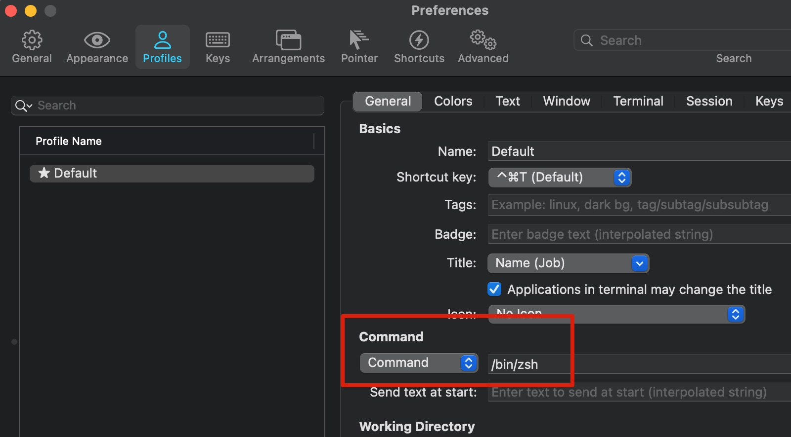
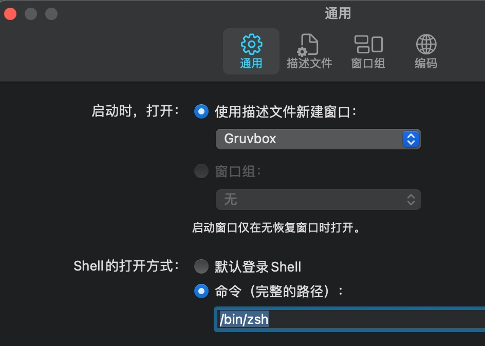

## 0x0 zsh 启动耗时查询

可以使用此命令对 shell 启动计时：

```bash
for i in $(seq 1 10); do /usr/bin/time $SHELL -i -c exit; done

# 执行后的效果：（优化后），优化前基本是 2s 左右
        0.44 real         0.22 user         0.14 sys
        0.41 real         0.22 user         0.15 sys
        0.37 real         0.21 user         0.13 sys
        0.37 real         0.22 user         0.12 sys
        0.35 real         0.20 user         0.12 sys
        0.31 real         0.18 user         0.11 sys
        0.41 real         0.22 user         0.14 sys
        0.42 real         0.23 user         0.14 sys
        0.40 real         0.22 user         0.14 sys
        0.38 real         0.22 user         0.13 sys

```

## 0x01 关闭登录启动模式
macos 的默认登录模式为 login -pf xxx, 打开后会打开 /var/log/asl (Apple System Log) 文件，并写 log.





## 0x02 NVM lazy load
替换原 nvm 设置命令，使用以下代替。效果：
默认使用系统级的
执行 nvm 时，才会加载 nvm

```bash
#export NVM_DIR="$HOME/.nvm"
#[ -s "$NVM_DIR/nvm.sh" ] && \. "$NVM_DIR/nvm.sh"  # This loads nvm
#[ -s "$NVM_DIR/bash_completion" ] && \. "$NVM_DIR/bash_completion"  # This loads nvm bash_completion

nvm() {
    echo "🚨 NVM not loaded! Loading now..."
    unset -f nvm
    export NVM_DIR="$HOME/.nvm"
    [ -s "$NVM_DIR/nvm.sh" ] && . "$NVM_DIR/nvm.sh"
    [ -s "$NVM_DIR/bash_completion" ] && \. "$NVM_DIR/bash_completion"  # Th      is loads nvm bash_completion
    nvm "$@"
  }
```

## 0x03 lazy load rbenv

```bash
 # Add RBENV init hook
 #eval "$(rbenv init -)"
rbenv() {
  unset -f rbenv
  eval "$(rbenv init -)"
  rbenv "$@"
}
```

## 0x04 移除 `brew --prefix`
测试下来，`brew –prefix` 需要接近 0.3s, 耗时明显

```bash
time brew --prefix go
#/usr/local/opt/go
#brew --prefix go  0.01s user 0.09s system 39% cpu 0.266 total


#PATH="$(brew --prefix php71)/bin:$PATH"
PATH="/usr/local/opt/php71/bin:$PATH"
```